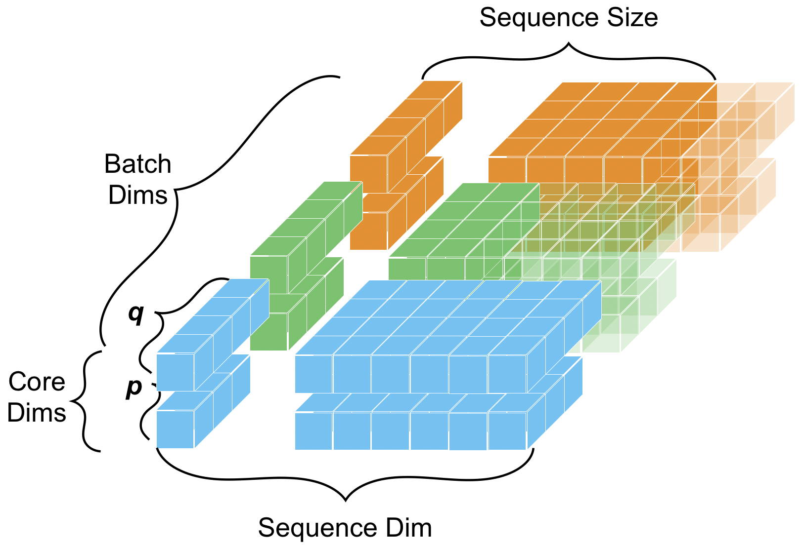

# TAL: Trajectory Analysis Library

[](https://klassak007.github.io/trajectory-analysis-library/)

TAL is a Python library for trajectory-shaped data: ordered, multidimensional data with semantic roles for batches, sequences, payload dimensions, parameter coordinates, and spatial frames.

TAL builds on xarray. It keeps xarray's labeled-array model, then adds the trajectory semantics needed to align, transform, reduce, compare, visualize, and persist real analysis data without losing what each dimension means.



## Why TAL?

Trajectory-shaped data appears in robotics, aerospace, simulation, controls, autonomy, biomechanics, sensor processing, and experimental analysis. The data is often stored as arrays or tables, but the important structure usually lives outside the array:

- which axis is the ordered sequence
- which dimensions identify independent runs, robots, scenarios, or trials
- which dimensions are vector, matrix, quaternion, or component payloads
- which coordinate should be used for interpolation or resampling
- which samples are valid in padded variable-length trajectories
- which coordinate frames spatial quantities relate to or are expressed in

TAL makes that structure explicit. The result is analysis code that can stay labeled, frame-aware, and intentional as it moves from raw logs to derived metrics and comparisons across runs.

## What Counts As A Trajectory?

In TAL, a trajectory is an ordered sequence of samples along a meaningful progression axis. That axis is often time, but it can also be sample number, simulation step, distance along a path, optimization iteration, phase, or another ordered parameter.

The value at each sample may be a scalar, vector, matrix, pose, velocity, acceleration, covariance, image metric, or another structured quantity.

| Example | Sequence axis | Payload |
|---|---|---|
| Robot pose over time | `time` | pose |
| Flight state over simulation steps | `step` | state vector |
| Error along a path | `arc_length` | scalar/vector |
| Optimization loss over iterations | `iteration` | scalar |
| Camera motion over video frames | `frame` | pose/velocity/image metric |

## Core Idea

```text
AnalysisObject = xarray-backed data + TAL schema metadata
```

The central type is `AnalysisObject`, usually shortened to AO. An AO wraps an `xarray.Dataset` and declares how its dimensions should be interpreted:

```text
batch dims     independent groups: run, robot, scenario, trial
sequence dim   ordered samples: time, frame, step, path progress
core dims      payload structure: xyz, quaternion, matrix rows/cols
param coord    physical coordinate used for interpolation/resampling
```

For example:

```text
run x sample x axis
```

can be declared as:

```text
batch x sequence x core
```

That role metadata is what lets TAL preserve trajectory meaning through indexing, interpolation, linear algebra, spatial transforms, event extraction, grouping, and I/O.

## Quick Example

```python
import numpy as np
import xarray as xr

from tal import AnalysisObject
from tal.linalg import Vector3

time = np.linspace(0.0, 5.0, 101)
velocity = np.stack(
    [
        np.ones_like(time),
        np.sin(time),
        np.zeros_like(time),
    ],
    axis=-1,
)

ds = xr.Dataset(
    {
        "velocity": (("sample", "axis"), velocity),
    },
    coords={
        "sample": np.arange(time.size),
        "time_s": ("sample", time),
        "axis": ["x", "y", "z"],
    },
)

ao = AnalysisObject.from_data(
    ds,
    sequence_dim="sample",
    core_dims=("axis",),
    param_coord="time_s",
)

speed = Vector3(ao).norm()
resampled = speed.param.at([0.5, 1.0, 1.5], on="time_s")
```

In this example:

- `sample` is the ordered sequence axis.
- `axis` is the vector payload axis.
- `time_s` is the parametric coordinate.
- `Vector3(ao).norm()` computes a vector norm without manually tracking `axis=-1`.
- `speed.param.at(...)` evaluates the trajectory at physical time values.

## Key Features

| Feature | What it gives you |
|---|---|
| `AnalysisObject` | xarray-backed data with TAL trajectory semantics |
| Dimension roles | explicit batch, sequence, and core dimensions |
| Parametric access | select, interpolate, and resample by time, phase, distance, or another coordinate |
| Ragged trajectories | variable-length runs represented with validity metadata |
| Linear algebra | vector and matrix operations that preserve trajectory structure |
| Spatial types | positions, rotations, poses, velocities, and accelerations |
| Frame semantics | parent/child frame relationships and expressed-in frames |
| Events/windows | threshold crossings, intervals, boundary samples, and around-event windows |
| Grouping/reductions | summaries across runs, scenarios, laps, agents, or segments |
| I/O/catalogs | persistence and browse/query/extract workflows for trajectory collections |
| Visualization | inspection of trajectories, components, events, and grouped results |

## Where TAL Shines

TAL is especially useful when you have many related trajectories sampled at different rates, with vector or spatial payloads, and you need to align them, transform them between frames, compute derived metrics, extract events, and summarize results across runs.

Common use cases include:

- robotics log analysis
- aerospace flight-test analysis
- simulation campaigns
- multi-agent experiments
- SLAM and state-estimation evaluation
- controls and trajectory tracking
- camera and sensor motion analysis
- repeated experiments with variable-length runs
- algorithm comparisons across scenarios

## Installation

TAL is under active development and is not yet presented as a stable PyPI release. For now, install from a source checkout:

```bash
git clone https://github.com/klassak007/trajectory-analysis-library.git
cd trajectory-analysis-library
pip install -e ".[dev]"
```

Optional dependency sets are split by surface area:

```bash
pip install -e ".[frames,viz,notebooks]"
pip install -e ".[ros,netcdf]"
```

Use `.[full]` when you want all optional surfaces installed in one environment.

## Documentation

The full documentation is available here:

**Docs:** https://klassak007.github.io/trajectory-analysis-library/

Useful links:

- [User Guide](https://klassak007.github.io/trajectory-analysis-library/user-guide/)
- [API Reference](https://klassak007.github.io/trajectory-analysis-library/api/)
- [Examples](examples/tutorial/)
- [GitHub Repository](https://github.com/klassak007/trajectory-analysis-library)
- [Issues](https://github.com/klassak007/trajectory-analysis-library/issues)


## Example Notebooks

The `examples/tutorial/` notebooks form the recommended learning path. The series builds from a small `AnalysisObject` to a complete autonomous-landing trajectory analysis workflow.

| Notebook | Topic |
|---|---|
| [01](examples/tutorial/01_quickstart_trajectory_workflow.ipynb) | Quickstart trajectory workflow |
| [02](examples/tutorial/02_construction_and_semantics.ipynb) | Construction and semantic roles |
| [03](examples/tutorial/03_indexing_and_selection.ipynb) | Indexing and selection |
| [04](examples/tutorial/04_timebase_resample_synchronize.ipynb) | Timebase, resampling, and synchronization |
| [05](examples/tutorial/05_conditions_events_and_windows.ipynb) | Conditions, events, and windows |
| [06](examples/tutorial/06_groupby_concat_and_ragged.ipynb) | Grouping, concatenation, and ragged trajectories |
| [07](examples/tutorial/07_linalg_array_matrix_vector.ipynb) | Arrays, matrices, vectors, and core dimensions |
| [08](examples/tutorial/08_spatial_position_rotation_pose.ipynb) | Spatial data: position, rotation, and pose |
| [09](examples/tutorial/09_kinematics_velocity_acceleration.ipynb) | Kinematics, velocity, and acceleration |
| [10](examples/tutorial/10_frames_and_topology.ipynb) | Frames and topology |
| [11](examples/tutorial/11_framegraph_and_spatial_types.ipynb) | Frame graphs and spatial types |
| [12](examples/tutorial/12_catalog_and_io.ipynb) | Catalogs and I/O |
| [13](examples/tutorial/13_visualization_holoviews_explorer.ipynb) | Visualization with HoloViews |
| [14](examples/tutorial/14_capstone_autonomous_landing.ipynb) | Capstone: autonomous landing |

New users should start with notebooks 01-04, then jump to the domain-specific notebooks that match their work.

## How TAL Compares

| Library | Focus | How TAL differs |
|---|---|---|
| xarray | Labeled N-dimensional arrays and datasets. | TAL builds on xarray-style data but adds trajectory roles, parametric coordinates, ragged validity, typed payloads, and spatial/frame semantics. |
| pandas | Tabular and time-series data. | TAL supports multidimensional trajectory-shaped data where each sample may contain vectors, matrices, poses, rotations, velocities, or other structured payloads. |
| NumPy / SciPy | Numerical arrays, scientific computing, interpolation, optimization, and linear algebra. | TAL preserves trajectory meaning around numerical computations: batch axes, sequence axes, core payload dimensions, param coordinates, and frame metadata. |
| pytransform3d | Transparent 3D transform utilities, representation conversions, transform graphs, and visualization/debugging. | TAL combines spatial transforms with trajectory and batch semantics, so spatial quantities can live inside ordered, labeled `AnalysisObject` data. |
| SpatialMath for Python | Robotics spatial-math classes such as SO(3), SE(3), quaternions, poses, and twists. | TAL focuses on analyzing collections of spatial quantities over ordered samples, runs, scenarios, and parameter grids. |
| rigid-body-motion | Estimating and transforming rigid-body motion across coordinate systems and reference frames, with xarray support and ROS `tf2`-style frame handling. | TAL overlaps most closely here, but has a broader semantic trajectory-analysis model: explicit batch/sequence/core roles, param-coordinate alignment, ragged trajectories, events/windows, catalogs, and a general `AnalysisObject` abstraction beyond rigid-body motion alone. |
| Vaex | Lazy, out-of-core DataFrames for large tabular datasets. | TAL focuses on structured trajectory-shaped arrays rather than flat tables; Vaex is more relevant as inspiration for large log browsing or catalog-scale preprocessing. |
| GTSAM | Factor graphs, SLAM, smoothing, and estimation. | GTSAM solves estimation problems; TAL is for representing, inspecting, comparing, transforming, and visualizing trajectories before or after estimation. |

TAL is especially close in spirit to `rigid-body-motion`: both care about frame-aware motion data and both recognize the value of xarray-style labeled arrays. TAL's differentiator is that it treats trajectory structure itself as the central abstraction. In TAL, rigid-body motion is one important use case within a broader model for ordered, batched, structured, and optionally frame-aware analysis data.


## Basic Concepts

### `AnalysisObject`

`AnalysisObject` is TAL's main user-facing wrapper. It stores an `xarray.Dataset` plus schema metadata describing the dataset's trajectory roles. You can still use familiar xarray-style operations, but TAL repairs and validates the metadata after structural changes.

### Dimension Roles

| Role | Example names | Meaning |
|---|---|---|
| batch dims | `run`, `robot`, `scenario`, `lap` | independent groups |
| sequence dim | `sample`, `frame`, `step` | ordered trajectory axis |
| core dims | `axis`, `component`, `row`, `col` | payload structure |

### Param Coordinates

The sequence dimension is the storage/index axis. A param coordinate is the physical or semantic coordinate attached to that axis.

```text
sample = integer position
time_s = physical coordinate attached to samples
```

Use `.sel()` and `.isel()` for ordinary xarray indexing. Use `ao.param` when analysis is about time, phase, distance, progress, or another ordered coordinate.

### Core Payloads

Core dimensions describe the value stored at each sample: scalar, vector, matrix, quaternion, covariance, pose components, or another structured payload. TAL's linear algebra and spatial layers use those dimensions as mathematical axes rather than anonymous array positions.

### Frames

Spatial data often needs more than numbers. TAL can track frame relationships such as `world -> robot` and expression frames such as "this velocity is written in the camera basis." That distinction matters when transforming positions, rotations, poses, velocities, and accelerations.

## Common Workflows

Create an AO:

```python
ao = AnalysisObject.from_data(
    ds,
    sequence_dim="sample",
    batch_dims=("run",),
    core_dims=("axis",),
    param_coord="time_s",
)
```

Select and slice:

```python
single_run = ao.sel(run="run_001")
first_second = ao.param.sel(slice(0.0, 1.0), on="time_s")
```

Resample or synchronize streams:

```python
aligned = telemetry.param.interp_like(video_frames, on="time_s")
```

Compute vector metrics:

```python
from tal.linalg import Vector3

speed = Vector3(velocity_ao).norm()
tracking_error = Vector3(estimate_ao - truth_ao).norm()
```

Work with spatial data:

```python
from tal.spatial import Position

position = Position(position_ao)
velocity = position.differentiate(on="time_s")
```

Detect events:

```python
from tal.core.event_ops import Condition

high_error = Condition.compare(Condition.var("error"), ">", 0.25)
events = error_ao.events.events(high_error)
windows = error_ao.events.around(high_error)
```

Save and load:

```python
ao.io.to_zarr("run.zarr")
loaded = AnalysisObject.from_zarr("run.zarr")
```

## Project Status

Current status: pre-1.0 research preview.

The core design is in place, but APIs may change before the first stable release. Early users should expect rapid iteration and pin versions or commits for reproducible work.

More stable:

- `AnalysisObject`
- dimension role metadata
- basic selection and reduction
- parametric interpolation/resampling
- vector operations

Experimental:

- advanced frame graph workflows
- ROS/log ingestion
- visualization explorer
- catalog extraction APIs
- public packaging and release process

## Design Principles

1. Make structure explicit.
2. Preserve semantics through operations.
3. Prefer labeled dimensions over positional axes.
4. Treat spatial and frame metadata as first-class analysis context.
5. Fail clearly when semantics are ambiguous.
6. Build on the scientific Python ecosystem.
7. Support realistic research workflows, not just toy arrays.

## Development

Install a local development environment from the repository root:

```bash
pip install -e ".[dev]"
```

Useful checks:

```bash
pytest
python -m sphinx -b html docs docs/_build/html
```

## Roadmap

- stabilize the v0.1 public API
- improve docs and executable examples
- harden spatial and frame semantics
- expand I/O examples and catalog workflows
- improve Dask, Zarr, and lazy-array workflows
- expand robotics and aerospace examples
- add benchmark datasets or representative example logs

## Feedback

TAL is not accepting unsolicited external pull requests while the pre-1.0 API is settling. Bug reports and design feedback are still useful when they include a minimal reproducer, expected behavior, and the TAL commit or version being evaluated.

## Citation

If you use TAL in research before a formal citation is published, cite the repository or use the metadata in [CITATION.cff](CITATION.cff):

```bibtex
@software{tal,
  title = {TAL: Trajectory Analysis Library},
  author = {Lassak, Kyle},
  year = {2026},
  url = {https://github.com/klassak007/trajectory-analysis-library}
}
```

## License

TAL is licensed under the Apache License, Version 2.0. See [LICENSE](LICENSE) for the full license text.

TAL declares dependencies on open-source Python packages, but does not vendor those dependencies into this repository unless explicitly noted. See [THIRD_PARTY_NOTICES.md](THIRD_PARTY_NOTICES.md) for dependency notice guidance.

## Acknowledgements

TAL builds on the scientific Python ecosystem, especially NumPy, xarray, pandas, SciPy, Dask, Zarr, HoloViews, and the ROS tooling ecosystem.
